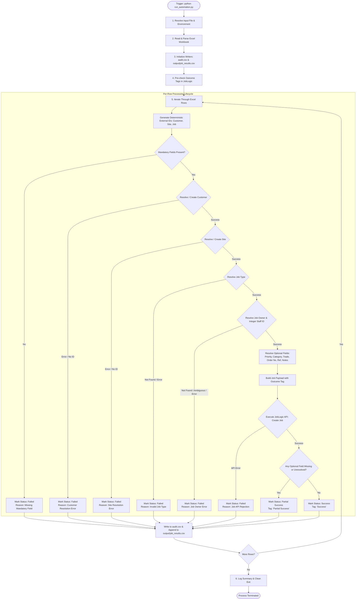

# JobLogic Automation — Comprehensive Release Notes & System Specification

## 1. Executive Summary

The **JobLogic Automation Engine** is a production-grade integration service designed to ingest job data from Excel spreadsheets and synchronize them into the **JobLogic Service Management Platform** via REST API.

The engine executes in **single-run execution mode** (triggered externally by an hourly scheduler) with complete audit logging, deterministic deduplication keys, and append-safe output tracking.

---

## 2. End-to-End Project Execution Flow



---

## 3. Field Specification & Classification Matrix

Each Excel record is evaluated against **Mandatory** and **Optional** criteria:

### 3.1 Mandatory Fields (Strict Validation)
If **any** mandatory field is blank or cannot be resolved against the JobLogic API, job creation is **aborted for that row**, and the row is marked as `Failed`.

| Field Name | Description | Resolution Rule & Failure Condition |
|---|---|---|
| **`Customer Name`** | Target Customer organization | Searched via `Customer/GetAll`. If absent, created via `Customer/Create`. Fails if resolution/creation fails or API returns no ID. |
| **`Site Name`** | Target Site / Property | Searched via `Site/GetAll` linked to Customer. If absent, created via `Site/Create`. Fails if resolution/creation fails or API returns no ID. |
| **`Job Description`** | Summary/scope of work | String must not be empty or whitespace only. |
| **`Job Type`** | Operational category/type | Looked up via `POST /JobType/GetAll`. Must match an existing JobLogic Job Type description exactly. |
| **`Job Owner`** | Assigned staff member | Preloaded via `POST /staff/GetAll`. Must match exactly one active staff member. Must successfully resolve the numeric integer Staff ID via `GET /staff?uniqueId=...`. Fails if missing, not found, ambiguous (multiple matches), or if numeric ID is missing. |

### 3.2 Optional Fields (Graceful Degradation)
Optional fields enrich the job record. If an optional field is blank, missing, or fails lookup in JobLogic, the row **does NOT fail**; instead, it proceeds with status **`Partial Success`**.

---

## 4. In-Depth Technical Logic: Tags & Staff ID (Job Owner)

### 4.1 Tag System & Outcome Tagging Logic

The JobLogic automation uses outcome-driven tags (`"Success"` and `"Partial Success"`) to categorize jobs in the JobLogic dashboard.

```
                  +-------------------------------+
                  | Pre-Run Tag Check (1x per run)|
                  | POST /Tag/GetAll (Success,    |
                  |       Partial Success)        |
                  +---------------+---------------+
                                  |
                                  v
                  +-------------------------------+
                  | Row Processing Outcome Check  |
                  +---------------+---------------+
                                  |
            +---------------------+---------------------+
            |                                           |
    All Optional OK?                           >= 1 Optional Missing /
            |                                      Unresolved?
            v                                           v
+-----------------------+                   +-----------------------+
|  Tag: ["Success"]     |                   |Tag: ["Partial Success"]
+-----------------------+                   +-----------------------+
            |                                           |
            +---------------------+---------------------+
                                  |
                                  v
                  +-------------------------------+
                  | Attach to payload:            |
                  | job_payload["Tags"] = [tag]   |
                  +-------------------------------+
```

#### Detailed Tag Lifecycle:
1. **Pre-Run Tag Verification (`_verify_tags`)**:
   - Before iterating through rows, the runner calls `POST /Tag/GetAll` for `"Success"` and `"Partial Success"`.
   - Results are cached for the entire run (`verified_tags = {"Success": bool, "Partial Success": bool}`).
2. **Outcome Tag Assignment**:
   - **`Success`**: Assigned when all mandatory fields AND all 6 optional fields are resolved.
   - **`Partial Success`**: Assigned when all mandatory fields are resolved, but 1 or more optional fields (`Job Priority`, `Job Category`, `Primary Job Trade`, `Order Number`, `Ref Number`, `Notes`) are empty or not found in JobLogic.
   - **`Failed`**: No job payload is submitted to JobLogic; therefore, no job tag is sent.
3. **Payload Construction**:
   - Tag is injected as a string list: `job_payload["Tags"] = [tag_name]`.
4. **Missing Tag Warning in Audit (`TagWarning`)**:
   - If a tag was not confirmed to exist during the pre-run check, a warning is recorded in the `TagWarning` column of `audit.csv` (`"Tag '<tag_name>' not found in Joblogic (sent in payload)"`).
   - The tag name is still included in the job payload (in case JobLogic auto-creates or dynamically applies it).

---

### 4.2 Staff ID (Job Owner) Resolution Logic

JobLogic requires a numeric **integer Staff ID** (`OwnerUserId`) placed inside `AdditionalDetail.OwnerUserId` in the job creation payload.

```
Excel "Job Owner" (e.g. "John Smith")
   │
   ▼
Step 1: Preload Active Staff List
   POST /staff/GetAll (SearchTerm="", IncludeInactive=false)
   Cached across the entire execution run (_staff_cache).
   │
   ▼
Step 2: Exact Name Matching (Case-Insensitive NFC Normalization)
   Matches Excel name against FullName or Name.
   ├─► 0 matches  ➔ Status: Failed (Reason: "Job Owner not found: <name>")
   ├─► >1 matches ➔ Status: Failed (Reason: "Job Owner is ambiguous: <name>")
   └─► 1 match    ➔ Extract UniqueId (GUID)
   │
   ▼
Step 3: Resolve Integer Staff ID
   GET /staff?uniqueId=<UniqueId>&tenantId=<TenantId>
   Cached in memory dictionary (_resolved_staff_ids[uniqueId]).
   ├─► IntId / UserId / StaffId found ➔ Converted to int(staff_id)
   └─► Missing / None                 ➔ Status: Failed (Reason: Staff ID resolution error)
   │
   ▼
Step 4: Payload Injection
   job_payload["AdditionalDetail"]["OwnerUserId"] = int_staff_id
   Diagnostic Log: "Excel Job Owner: ... | Resolved UniqueId: ... | Resolved Staff ID: ..."
```

#### Key Rules for Job Owner:
- **Mandatory**: If `Job Owner` is empty, the row immediately fails with `"Job Owner is required"`.
- **Exact Matching Only**: Prefix, partial, or substring matches are strictly rejected.
- **Ambiguity Guard**: If multiple staff share the same name, execution safely halts for that row with `"Job Owner is ambiguous"` to avoid assigning jobs to the wrong person.
- **Two-Step API Resolution**: Uses `POST /staff/GetAll` for discovery followed by `GET /staff?uniqueId=...` for numeric integer ID resolution.
- **Performance Caching**: Staff list and resolved integer IDs are cached in memory to minimize API latency and prevent rate limiting.

---

---

## 4. Execution Outcomes & Status Definitions

```
+-------------------------------------------------------------------------+
|                              ROW OUTCOMES                               |
+-------------------------------------------------------------------------+
|                                                                         |
|  [ SUCCESS ]          All Mandatory OK  +  All Optional OK              |
|                       Job Created in JobLogic                           |
|                       Tag: ["Success"]                                  |
|                                                                         |
|  [ PARTIAL SUCCESS ]  All Mandatory OK  +  >= 1 Optional Empty/Invalid  |
|                       Job Created in JobLogic                           |
|                       Tag: ["Partial Success"]                          |
|                                                                         |
|  [ FAILED ]           >= 1 Mandatory Missing or Resolution Error OR     |
|                       Customer / Site / Job Owner / Job Type Error OR   |
|                       JobLogic API Rejection                            |
|                       Job NOT Created                                   |
|                       Tag: None                                         |
|                                                                         |
+-------------------------------------------------------------------------+
```

### Case 1: `Success`
- **Trigger**:
  - All 5 Mandatory fields are present and resolved.
  - Customer exists or was successfully created.
  - Site exists or was successfully created.
  - Job Type found in JobLogic.
  - Job Owner found with unambiguous integer Staff ID.
  - **All 6 Optional fields** (`Job Priority`, `Job Category`, `Primary Job Trade`, `Order Number`, `Ref Number`, `Notes`) are present and successfully validated.
  - JobLogic API successfully returns `200/201` with Job ID and Job Number.
- **Actions Taken**:
  - `Tag`: Sent as `["Success"]`.
  - `output/job_results.csv`: Row logged with Status `Success`, actual API `Job Number`, and actual `Job ID`.
  - `audit.csv`: Status `Success`, `JobAction: Created`, `MissingFields: ""`, `PartialFields: ""`.

### Case 2: `Partial Success`
- **Trigger**:
  - All 5 Mandatory fields are present and resolved.
  - Customer and Site resolved / created.
  - Job Type and Job Owner resolved.
  - **One or more Optional fields** are missing, empty, or unresolvable.
  - JobLogic API successfully creates the job with the available payload.
- **Actions Taken**:
  - `Tag`: Sent as `["Partial Success"]`.
  - `output/job_results.csv`: Row logged with Status `Partial Success`, actual API `Job Number`, actual `Job ID`.
  - `audit.csv`: Status `Partial Success`, `JobAction: Created`, `PartialFields` lists the specific fields (e.g. `Job Priority, Notes`).

### Case 3: `Failed`
- **Trigger**:
  - Any mandatory field missing (e.g., missing Job Description, blank Job Owner).
  - Customer or Site resolution failure.
  - Unrecognized Job Type.
  - Job Owner not found, ambiguous name, or unable to resolve integer Staff ID.
  - Job creation endpoint rejected payload.
- **Actions Taken**:
  - `Job`: **NOT created**.
  - `output/job_results.csv`: Logged with Status `Failed`, `Reason: <Descriptive Error Message>`, `Job Number: ""` and `Job ID: ""`.
  - `audit.csv`: Status `Failed`, `JobAction: Not Created`, with exact failure diagnostic under `Error` or `MissingFields`.

---

## 5. Scheduling & Production Triggering

### 5.1 Business Schedule Specification
- **Timezone**: `Europe/London`
- **Cron Expression**: `0 8-16 * * 1-5`
- **Execution Window**: Monday through Friday, 08:00 to 16:00 UK local time
- **Active Trigger Hours**: `08:00`, `09:00`, `10:00`, `11:00`, `12:00`, `13:00`, `14:00`, `15:00`, `16:00` (9 runs/day, 45 runs/week)
- **Excluded Windows**:
  - No run at `17:00`
  - No run on Saturday (`6`) or Sunday (`0/7`)
  - No run between `17:00` and `07:59`

### 5.2 Architectural Principle
The application does not use internal background loops (`while True`, `sleep`, or persistent daemon threads). The operating system or hosting orchestrator (Windows Task Scheduler, Linux cron, Cloud scheduler) executes `python run_automation.py` on each cron tick. The process runs to completion and exits with code `0`.

### 5.3 Local Schedule Inspection Command
To safely verify the production schedule without making network calls or touching Excel/JobLogic:
```bash
python run_automation.py --check-schedule
```

---

## 6. Output Files & Audit Persistence

| Output Target | Write Mode | Behavior Across Hourly Runs |
|---|---|---|
| **`output/job_results.csv`** | Append-only (`initialize()`) | Master business results file. Creates header on first run. Appends every processed row across all runs. Historical results are never overwritten. Stores only actual API Job Numbers and IDs. |
| **`audit/audit_YYYY-MM-DD.csv`** | Daily Date-Stamped & Append-only (`initialize()`) | Automatically generates a daily audit file (e.g., `audit/audit_2026-08-25.csv`). Includes a `Timestamp` column with the exact UTC execution time for each row. All 9 hourly runs for the day accumulate cleanly. |

---

## 7. Deterministic Identifiers & Idempotency

To ensure system integrity across hourly runs, SHA-256 deterministic External IDs are generated for each entity:
- **Customer**: `JLA-C-<sha256(v1|customer|normalized_name)>[:32]`
- **Site**: `JLA-S-<sha256(v1|site|normalized_customer|normalized_site)>[:32]`
- **Job**: `JLA-J-<sha256(v1|job|customer|site|canonical_field_json)>[:32]`

> **Deployment Note:** If the same spreadsheet is submitted repeatedly without changes, the exact same `ExternalId` is generated. Verification in UAT is recommended to confirm whether JobLogic's API enforces strict deduplication on `ExternalId`.
